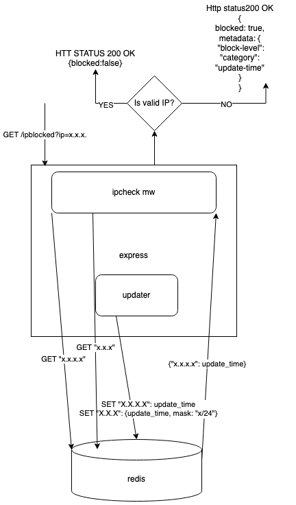

# ipchecker

a service that will offer the possibility of knowing if a given IP is untrusted according to some of the rules defined in https://github.com/firehol/blocklist-ipsets .
We will include individual IPS (X.X.X.X) and support for netsets (just with the three first segments of the ip) and masks.

# Detailed design



The service logic will be splitted in two components: an express controller for the route responsible for checking if an ip is valid and an updater that will asynchronously be populating the cache that the route will use.

## route ipblocker
We will use a cache (redis) to hold the information as it will be fast and suitable for holding the ips/ips with masks.
There may be two types of entries in cache (in different redis tables):
    •    "X.X.X.X" : { update_time, security }
    •    "X.X.X.X/24": { update_time, security}
The controller route will first query cache to check for single ip blocked; if not success (when hitting cache), we will check if it belongs to a subnet blocked using an inmemory object of IpSet(https://www.npmjs.com/package/ip-set) with all subnets loaded to check if the ip belongs to any of this subnets.
If there is a match, a 200 with the payload described in the picture  will be returned directly from the mw.

The API will follow a restful style would be something like this:

GET /ipblocked?ip=X.X.X.X

The response code will be 200 OK for this service when everything is going well:

Body Answers : 
For a valid unblocked IP:
```json
{
    “blocked”: false
}
```

For a blocked IP:
```json
{
“blocked”: true
“metadata”: {
{
   "block-level": 1,
   "category": "single-ip",
   "update-time": "2022-01-24T22:55:33.529Z"
}
}
```

When there is not a match the response will be simply:
```json
{
    "blocked": false
}
```

After the response for cache is get, update_time will be checked from the updater module and will be used to automatically discard false positives: those ips that have being removed from the source and are still in cache. When a request is checking a given ip it should ignore and delete the cache entry if the time has been expired. a function will be exposed in updater module for doing that check.


## updater

that will be a timer task utility that will be initialized when the express app is started and periodically will be populating and updating the cache with the IPs that are susceptible of being blocked.
The cache entries will have a ttl of one day (bigger enough) to have an automatic way of cleaning unused stuff; this won't be the main expiration process of the ips as I will explain later.

When the updater timer fires, the updater will perform several http request simultaneously to the different sources configured. the configuration file will be and array of objects like this:
[ {
source: zeus_badips,
url: https://github.com/firehol/blocklist-ipsets/blob/master/alienvault_reputation.ipset
},
]
in json format

Every handler will parse the response excluding lines beginning by # and set an entry in the cache depending on the type inferred from the line
for ip:
SET <ip_file>: {update_time: <date>}
for subnets:
HSET hash <ip_file>: {update_time: <date>}


Note: update_time will be the same for the whole update process and will be calculated once at the start.

When a update process has ended an instance of IpSet (https://www.npmjs.com/package/ip-set) will be created and replace the old one, for checking subnets blocked.

An entry from the cache will expire after a day (configurable) but it will be deleted manually (and discard as false positive) when it has not been updated by the updater module at some time where the source of ip has removed then; this logic will reduce complexity in updater as it will simply add (or update) all entries recovered from the sources. We need that process to avoid cleaning everything and populate again to avoid interrupting the service run.


## Discarded options

Use a database for storing and querying ips:

* too much hits per second, it should be tunned...
*The updates can lead to big complexity
* It really doesn't add any failover when network issues are happening as we may give false positives, the newtowk issues should be fixed in the source of truth in any case...

use a File

* not for looking in a file opened, this would be horrible for performance and merge several files ... not a good choice
* It could be a good solution if the number of ips would be small (hundreds..) and I will store them in memory-cache for quick search, but the number may grow and can lead to out of memory errors.

## Future

* The github repo is just updated once per day, we may go to https://iplists.firehol.org/ and configure every ip source going directly to the url that published the information. (we can add check frequency, level of security check....)

* Add level of security checks: the source of the info can determine this but the presence in several sources can also increase the security
* Dynamically updating with a crud service the sources; moving the source from config to database in that case.
* Add a failover ip for every source (it could be the github page that has the data populated from all sources).
* Add an update_time for every source (considering the source of data and the frequency of changes).
* Extend metadata responses with more useful information.
* Whitelist ips
* Expand netsets and store them individually ?
* Technical debt, registered in source code

